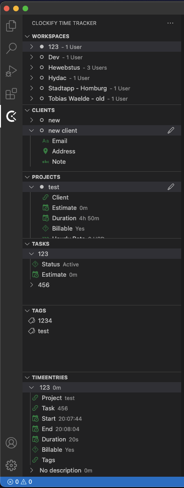

# Clockify

<!-- project badges -->


Implements [Clockify](https://clockify.me/) time tracker in VSCode.


## Functions
You can manage your workspaces, clients, projects, tasks and time entries. You can start and stop a timer on the status bar or automatically by adjusting the settings for the workspace in which you want to enable the auto tracking.

## Installation
Launch VS Code Quick Open (`Ctrl+P`), paste the following command, and press enter:
```
ext install tobiaswaelde.clockify-tracker
```

Or you can just search for "Clockify" in the Extensions view.

## Preview


## Getting Started
[Getting Started](https://github.com/tobiaswaelde/vscode-clockify/wiki/Home)


## Configuration

*All keys starting with `simpleChangelog.`*

| Settings key                   | Type    | Default value | Description                                                                                  |
| ------------------------------ | ------- | ------------- | -------------------------------------------------------------------------------------------- |
| apiKey                         | string  | ` `           | The clockify API key.                                                                        |
| fetchLimit                     | number  | `200`         | Limit the number of items that will be fetched for displaying in the tree view.              |
| hideSensitiveData              | boolean | `false`       | Hide sensitive data. Can be useful for screenshots.                                          |
| showIds                        | boolean | `false`       | Show IDs of the data.                                                                        |
| workspaces.showNumberOfMembers | boolean | `true`        | Show the number of members for each workspace.                                               |
| tracking.workspaceId           | string  | ` `           | The ID of the default workspace.                                                             |
| tracking.projectId             | string  | ` `           | The ID of the default project in the workspace. `clockify.tracking.workspaceId` must be set. |
| tracking.taskId                | string  | ` `           | The ID of the default task in the workspace. `clockify.tracking.workspaceId` must be set.    |
| tracking.billable              | boolean | `false`       | Check if Time Entry is billable.                                                             |
| tracking.autostart             | boolean | `false`       | Start tracking with opening the IDE.                                                         |
| tracking.autostop              | boolean | `true`        | Stop tracking with closing the IDE.                                                          |