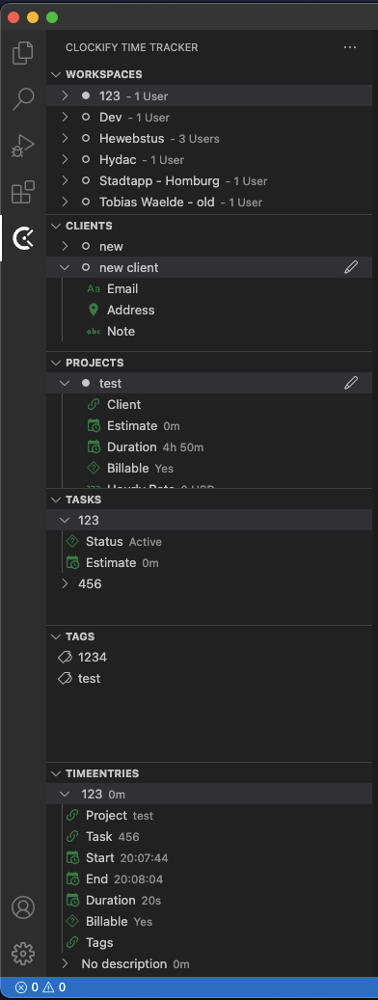

# Clockify for VS Code

Manage Clockify workspaces, clients, projects, tasks, tags and time entries directly in VS Code.

## Setup

1. Install the `tobiaswaelde.clockify-tracker` extension.
2. Run **Clockify: Set API key**.
3. Select a default workspace when prompted.

The API key is stored securely in VS Code SecretStorage rather than in user or workspace settings.

## Configuration

All settings use the `clockify.` prefix. Open VS Code Settings and search for `Clockify` to configure tracking defaults, auto-start, auto-stop and tree-view options.

When Timesheet is enabled for a Clockify workspace, selecting a project is required before a timer can start so the completed entry appears in Timesheet. If a project-less timer was started elsewhere, the extension asks for a project before stopping it.

## Tree view

Projects can be renamed or deleted from their context menu. Deleting a project requires confirmation and refreshes the related Projects, Tasks, and Time Entries views.

