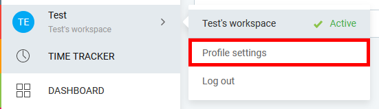

# Get Started
## Step 1: Generate API key
1. Open your browser and navigate to [`https://clockify.me/tracker`](https://clockify.me/tracker)
2. Open profile settings

    
3. Scroll down and create an API key

    

## Step 2: Add API Key to extension settings
1. In VS Code press `F1` to open command palette
2. Type `Clockify: Set API key` and press `Enter`
3. Insert your API key and press `Enter`

## Step 3: Open Clockify Explorer
1. Click the Clockify icon in the sidebar panel

    

2. You should see something like this

    
